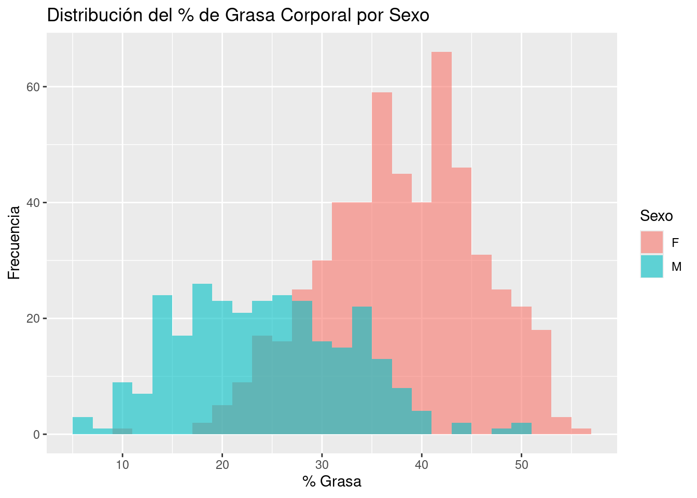
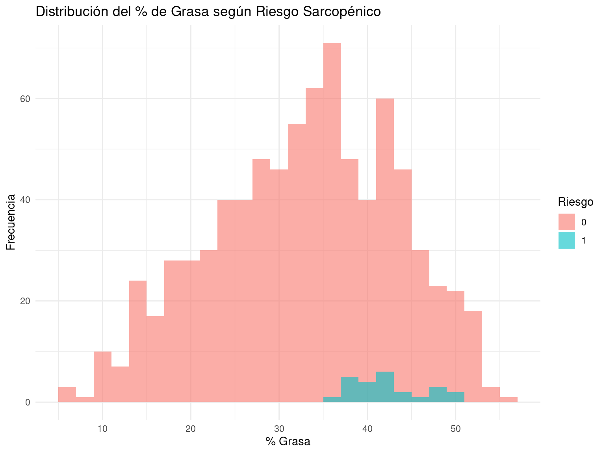
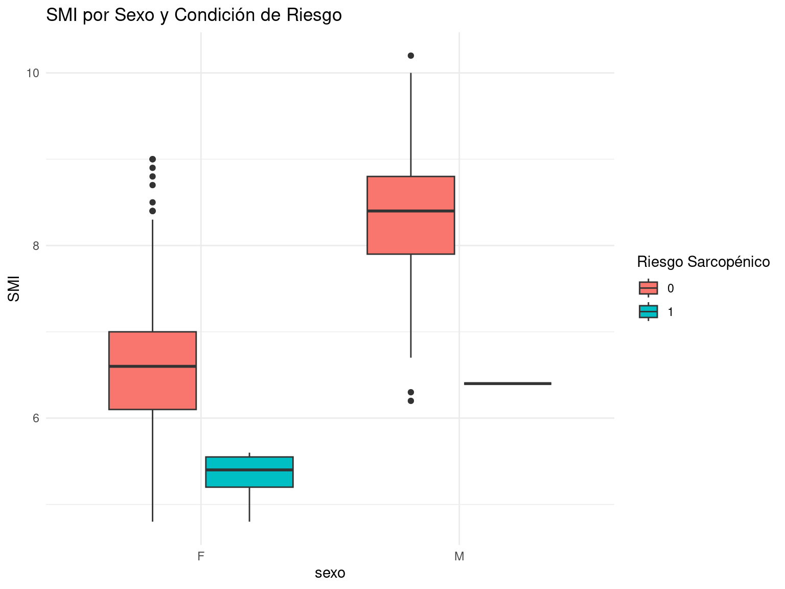

# Cátedra 1 - Programación en R  
**Magíster en Data Science - Universidad de Las Américas**  
Autora: Evelyn Sánchez  
Fecha: Mayo 2025  

---

## Descripción del Proyecto

El proyecto planteó como objetivo el desarrollar un modelo predictivo que permita identificar individuos en riesgo de obesidad sarcopénica a partir de variables de composición corporal obtenidas mediante bioimpedancia (InBody). 
El análisis se basa en un conjunto de datos obtenidos a partir de evaluaciones de composición corporal realizadas mediante bioimpedancia eléctrica (InBody®), una técnica no invasiva ampliamente utilizada en contextos clínicos y comunitarios. Esta tecnología permite estimar con alta precisión parámetros corporales relevantes para la salud metabólica y funcional.

La base de datos original contiene más de 100 variables; sin embargo, para los fines de este estudio se seleccionaron aquellas con mayor relevancia clínica y fisiológica en el contexto del diagnóstico de obesidad sarcopénica.
Las variables consideradas fueron:

- Sexo y edad 
- Estatura y peso corporal
- Porcentaje de grasa corporal (%)
- Masa muscular esquelética (kg)
- Índice de masa muscular esquelética (SMI, Skeletal Muscle Index)

Estas variables permitieron estimar el estado nutricional, la composición corporal y la condición funcional del individuo, y constituyen la base para el desarrollo de un modelo predictivo orientado a identificar individuos en riesgo de obesidad sarcopénica

El trabajo se desarrolló en RMarkdown e incluyó el preprocesamiento de datos, análisis exploratorio, visualización de resultados, construcción de un modelo y su validación.

---

## Metodología Aplicada

El desarrollo del análisis se realizó siguiendo los principios del ciclo de ciencia de datos, en las siguientes etapas:

- Definición del problema: Identificar personas con riesgo de obesidad sarcopénica en base a datos de bioimpedancia.
- Importación y limpieza de datos: Corrección de formatos numéricos, tratamiento de datos faltantes, selección de variables clave.
- Análisis exploratorio (EDA): Visualización de la distribución y relaciones entre variables según sexo y riesgo.
- Modelado predictivo: Ajuste de un modelo de regresión logística para estimar la probabilidad de riesgo sarcopénico a partir de edad, sexo, % grasa y SMI.
- Desarrollo de función personalizada: Creación de una función en R que permite aplicar la clasificación a nuevos datos.
- Validación y evaluación del modelo: Uso de predicciones, matriz de confusión y visualización de resultados.

---

## Ejemplo de gráficos generados

  
  

---

## Estructura del Repositorio

- `CATEDRA_1_PROGRAMACION_R.Rmd`: Documento RMarkdown con todo el desarrollo del proyecto.
- `InBodyExcelData_catedra R.xlsx`: Archivo de datos original utilizado.
- `outputs/`: Carpeta que contiene las visualizaciones generadas.
- `README.md`: Este archivo, con resumen explicativo.

---

## Conclusión

El análisis permitió desarrollar un modelo predictivo robusto para la detección del riesgo de obesidad sarcopénica, utilizando variables obtenidas a partir de mediciones de bioimpedancia con INBODY 370s. A través del uso de regresión logística, se integraron factores clave como sexo, edad, porcentaje de grasa corporal y SMI, permitiendo estimar la probabilidad individual de riesgo con buena precisión.

El modelo mostró un desempeño adecuado según métricas como exactitud, sensibilidad y especificidad, lo que refuerza su potencial como herramienta de tamizaje en contextos clínicos y comunitarios. La incorporación de una función automatizada (evaluar_sarcopenia()) permite su futura implementación en sistemas digitales de salud, facilitando la toma de decisiones basadas en datos.

Estos resultados evidencian la utilidad de la ciencia de datos aplicada al ámbito de la salud, y abren posibilidades para el desarrollo de soluciones predictivas escalables y adaptadas a las necesidades locales.

Para el desarrollo de este trabajo se utilizó Chat GPT 4.0 para la revision de codigos y errores, ademas de sugerencias ya que al estar cursando en paralelo asignaturas como estadistica requerí profundizar tematicas aun no revisadas.

---

